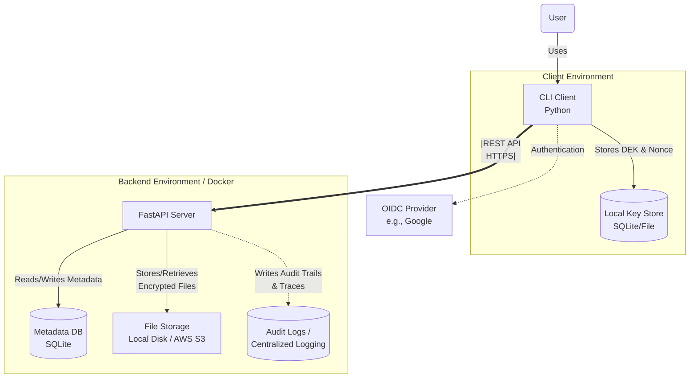
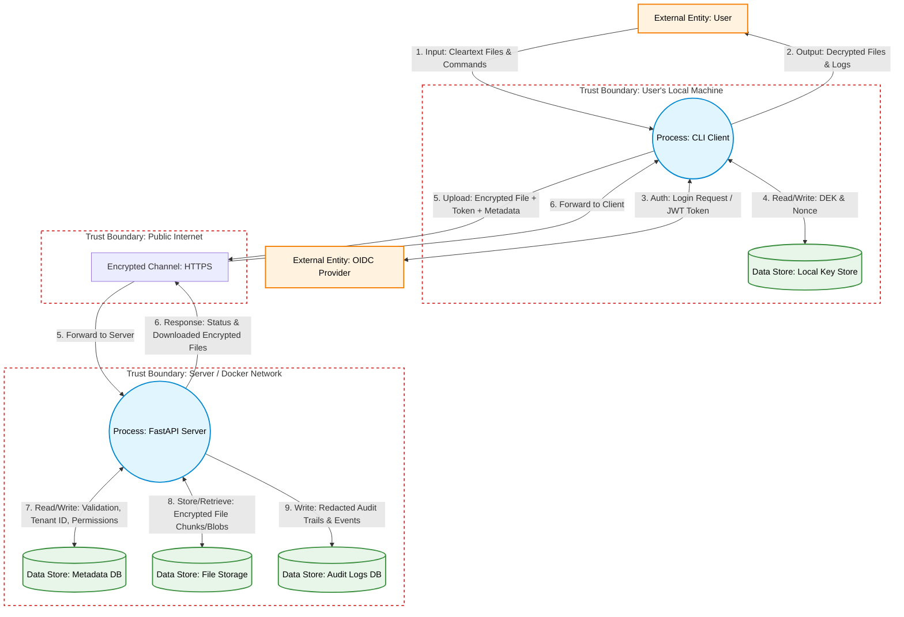

# Secure File Storage

Final report for the Software Security Engineering assignment.

This project implements a secure cloud-style file storage platform with:

- a FastAPI backend (`server/`)
- a terminal CLI client (`cli/`)
- client-side encryption in Full Privacy Mode
- multi-tenant authorization controls
- security-focused tests and CI checks

## Installation And Usage

This section is intentionally first, as requested in the assignment deliverable.

### Prerequisites

- Linux/macOS/WSL
- Python 3.12+
- `pip`
- Docker + Docker Compose (optional, for container deployment)

### Local Setup

1. Create and activate a virtual environment:

```bash
python3 -m venv venv
source venv/bin/activate
```

2. Install dependencies:

```bash
pip install -r server/requirements.txt -r server/requirements-dev.txt
```

3. Configure environment variables:

```bash
export GOOGLE_CLIENT_ID="your_google_client_id.apps.googleusercontent.com"
export API_TOKEN="<oidc_jwt_token>"
export API_URL="http://127.0.0.1:8000"

# Optional: if your local UID/GID is not 1000, export these for Docker builds.
export UID="$(id -u)"
export GID="$(id -g)"

# Optional, local development only (not recommended for real deployments):
# export ALLOW_INSECURE_OIDC_FOR_DEV=true
# export MAX_UPLOAD_BYTES=52428800
# export SIZE_OBFUSCATION_BLOCK_BYTES=1048576
```

4. Run the API:

```bash
uvicorn server.main:app --reload
```

5. Use the CLI (from repository root):

```bash
python cli/main.py --help
```

### Docker Setup

1. Set required variable:

```bash
export GOOGLE_CLIENT_ID="your_google_client_id.apps.googleusercontent.com"
```

2. Build the image:

```bash
docker build -f deploy/Dockerfile -t secure-file-storage-api:latest .
```

3. Run the container:

```bash
docker rm -f secure-file-storage-api >/dev/null 2>&1 || true
docker run -d --name secure-file-storage-api \
	-p 8000:8000 \
	-e GOOGLE_CLIENT_ID="$GOOGLE_CLIENT_ID" \
	-e DATABASE_URL=sqlite:////app/data/filestorage.db \
	-e STORAGE_DIR=/app/data/storage \
	-v "$PWD/data:/app/data" \
	secure-file-storage-api:latest
```

4. API endpoint:

- `http://127.0.0.1:8000`

5. Stop service:

```bash
docker stop secure-file-storage-api
```

### CLI Command Reference

- `python cli/main.py list`
- `python cli/main.py upload <filepath>`
- `python cli/main.py download <file_id> [output]`
- `python cli/main.py share <file_id> <target_user>`
- `python cli/main.py create-anonymous-link <file_id>`
- `python cli/main.py import-key <file_id> <name>`
- `python cli/main.py delete <file_id>`
- `python cli/main.py erase-key <file_id>`
- `python cli/main.py migrate-vault`

### Example User Flow

```bash
python cli/main.py upload ./notes.txt
python cli/main.py list
python cli/main.py download <file_id> recovered_notes.txt
```

## Project Overview

The goal is to provide a secure storage service where the backend never receives plaintext files in Full Privacy Mode.

Core capabilities implemented:

- Upload, download, delete, and list encrypted files
- File versioning via update endpoint
- Authenticated file sharing
- Anonymous share links with expiration
- Read and update permission controls (`read` / `read/write` behavior)

## Assignment Requirements Mapping (WA)

### Implemented

- REST API core features (upload/download/delete/list/version/share/permissions)
- Terminal-based client
- OIDC JWT validation with Google JWKS
- Multi-tenant logical isolation and authorization checks
- Threat model deliverables:
	- architecture diagram
	- DFD
	- STRIDE analysis
	- derived security requirements
- Security test suite (tenant isolation, misuse, permission controls)
- Security test suite with 13 automated scenarios (authorization, TTL, DoS protections, and consistency checks)
- CI security checks (tests, static analysis, dependency scan, secret scan)
- Secure-by-default Docker setup (non-root user, no-new-privileges, dropped caps)
- File-size obfuscation baseline (client-side fixed-block padding before encryption)

### Optional Items Not Fully Implemented

- Admin portal and audited impersonation workflow
- Hybrid storage abstraction (Local + S3)
- Advanced traffic-analysis defenses beyond baseline padding (chunk mixing/cover traffic)

## Architecture

Architecture and threat-model artifacts are documented in:

- `docs/architetureDiagram.md`
- `docs/threat_model.md`

### System Architecture Diagram



### Data Flow Diagram (DFD)



High-level components:

- CLI client (encryption/decryption + local key vault)
- FastAPI service (auth, authorization, file metadata, sharing)
- SQLite metadata database
- Local file storage for encrypted blobs
- Centralized app logging with redaction and request tracing

## Security Guarantees And Design Decisions

### 1. Full Privacy Mode (Client-Side Encryption)

- Encryption algorithm: AES-256-GCM
- Nonce generation: random 96-bit nonce (`os.urandom(12)`) per encryption operation
- Integrity: authenticated encryption (tag verification on decrypt)
- Server stores only encrypted blobs and file UUID references

Decision rationale:

- AES-GCM provides confidentiality + integrity in one primitive.
- Per-operation nonce generation mitigates catastrophic nonce reuse risks.

### 2. Key Management

- Each uploaded file gets its own DEK (data encryption key).
- DEKs are stored in a local key vault (`local_keys.json`) that supports encrypted-at-rest mode.
- Vault protection uses Scrypt-derived key + AES-GCM.
- Legacy plaintext vault migration is provided (`migrate-vault`).

Decision rationale:

- Per-file keys reduce blast radius if one key is compromised.
- Local encrypted vault improves key confidentiality on client machine.

### 3. Tenant Isolation

- File listing is scoped to owner/shared relations.
- Download/update retrieval is owner-or-shared scoped before data access.
- Unauthorized cross-tenant probes return `404` to reduce file-existence leakage.

Decision rationale:

- Tenant isolation is a first-class requirement in WA.
- Anti-enumeration behavior improves confidentiality of metadata.

### 4. Authentication And Authorization

- JWT verification via Google OIDC JWKS.
- `GOOGLE_CLIENT_ID` audience validation enabled by default.
- Local development override requires explicit `ALLOW_INSECURE_OIDC_FOR_DEV=true`.
- Per-file permission model supports owner and shared-user write restrictions.

Decision rationale:

- Secure-by-default auth avoids accidental weak deployments.
- Explicit dev override keeps local testing possible without silently weakening prod behavior.

### 5. Observability And Abuse Resistance

- Request-ID middleware adds `X-Request-ID` in responses and logs.
- Log formatter redacts bearer tokens and email-like strings.
- Sliding-window per-IP rate limiting reduces brute-force and abuse.

Decision rationale:

- Traceability is necessary for incident response.
- Redaction reduces risk of sensitive data leakage via logs.

### 6. Week 6.1 Hardening Results

- Rate limiting now resolves client IP from `X-Forwarded-For` / `X-Real-IP` with safe fallback.
- File uploads enforce a configurable maximum payload size (`MAX_UPLOAD_BYTES`) and return `413` when exceeded.
- Missing-storage scenarios now trigger stale metadata cleanup and return `410` instead of persisting orphan records.
- AI-assisted review decisions are documented in `docs/ai_hardening_6_1.md`.

## API Reference (Summary)

Authenticated routes:

- `GET /` health check
- `GET /users/me`
- `POST /files/`
- `PUT /files/{file_id}`
- `GET /files/`
- `GET /files/{file_id}/download`
- `DELETE /files/{file_id}`
- `POST /files/{file_id}/share`
- `POST /files/{file_id}/anonymous-link`
- `GET /files/{file_id}/permissions`
- `PUT /files/{file_id}/permissions`
- `PUT /files/{file_id}/ttl`

Client-side vault commands:

- `python cli/main.py import-key <file_id> <name>`
- `python cli/main.py migrate-vault`
- `python cli/main.py erase-key <file_id>`

Public route:

- `GET /anon/{link_id}`

## Secure Development Lifecycle (SDLC) Process

Project planning and weekly milestones are tracked in `docs/progress.md`.

Process followed:

1. Threat modeling and requirement derivation.
2. Secure architecture and data model design.
3. Implementation with security controls (authn/authz, redaction, encryption).
4. Security-focused testing and hardening.
5. CI automation of security checks.
6. Deployment hardening and final documentation.

Threat-model outputs are in `docs/threat_model.md` and include:

- DFD and trust boundaries
- STRIDE risks and mitigations
- explicit security requirements used as implementation checklist

## Security Testing And CI Evidence

### Local Tests

Run tests:

```bash
./venv/bin/python -m pytest -q
```

Current tests cover:

- tenant isolation
- permission bypass attempts
- API misuse cases
- anonymous link expiration behavior
- file TTL enforcement
- upload size limit enforcement
- orphan metadata cleanup behavior
- owner-only TTL update authorization
- owner-only delete authorization
- shared-user write positive path (`read/write`)
- forwarded-IP aware rate-limiting behavior
- metadata rollback on oversized upload rejection (`413`)

Current local status: `13 passed`.

### CI Pipeline

Workflow file: `.github/workflows/security-ci.yml`

Automated checks:

- `pytest` (functional + security scenarios)
- `bandit` (static security analysis)
- `pip-audit` (dependency vulnerabilities)
- `detect-secrets` (secret scanning)

## Deployment Security Posture

Container hardening in `deploy/Dockerfile` and `deploy/docker-compose.yml` includes:

- non-root runtime user
- dropped Linux capabilities (`cap_drop: ALL`)
- `no-new-privileges` security option
- secrets/config from environment variables

## Limitations And Future Work

Current limitations:

- OIDC token acquisition/login UX is external to this repo.
- Shared-file key exchange is manual and out-of-band.
- Rate limiting is in-memory (not distributed).
- Storage backend is local disk + SQLite only.

Future improvements aligned with WA optional items:

- Admin/support portal with justified, time-bound impersonation audit trail
- storage backend abstraction (S3/local)

## Project Structure

```text
server/            FastAPI backend (auth, models, logging, API)
cli/               CLI app + cryptography helpers
deploy/            Docker assets
docs/              Architecture, threat model, progress report
tests/             Automated security tests
.github/workflows/ CI security pipeline
```

## Security Policy

Security disclosure process is documented in `SECURITY.md`.

## License

See `LICENSE`.