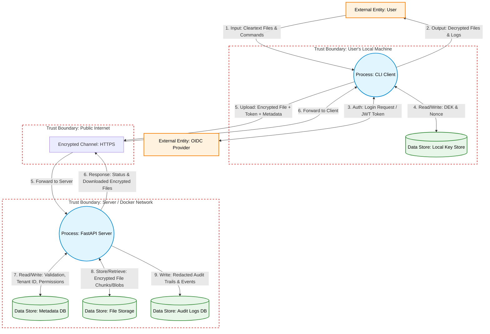

## Data Flow Diagram (DFD)

## STRIDE Threat Analysis

Based on the architecture and the Data Flow Diagram (DFD), we performed a threat analysis using the STRIDE methodology to identify potential vulnerabilities at the trust boundaries.

| Threat Category | Potential Threat in Our System | Affected Component / Flow | Mitigation Strategy |
| :--- | :--- | :--- | :--- |
| **Spoofing** | An attacker intercepts or forges an OIDC token to impersonate a legitimate user and access their files. | Flow 3 & 5 (Public Internet) | Strict cryptographic validation of the OIDC JWT (signature, audience, and expiration) on the FastAPI server. |
| **Tampering** | A malicious actor or compromised network alters the encrypted file chunks in transit, or modifies the metadata directly in the SQLite database. | Flow 5 (Internet) & Flow 7 (Backend DB) | Use of TLS (HTTPS) for transit. Client-side encryption using **AES-GCM** ensures data integrity (tamper-evident). Use of SQLAlchemy ORM to prevent SQL Injection. |
| **Repudiation** | A user maliciously deletes a shared file and denies doing so, or support staff accesses files without traceability. | P2 (FastAPI Server) | Comprehensive centralized audit logging. All critical actions (upload, delete, permission changes) must be logged with a unique `Request-ID`, Timestamp, and the user's OIDC Subject ID. |
| **Information Disclosure** | The server or a cloud provider (AWS S3) inspects the file contents. Another tenant accesses metadata belonging to a different user. | Flow 8 (File Storage) & DS2 (Metadata DB) | **Full Privacy Mode:** Client-side encryption ensures the server only sees ciphertext. Strict **Multi-Tenancy isolation** logic ensures DB queries are always scoped to the authenticated user's Tenant ID. Filenames are anonymized (UUIDs). |
| **Denial of Service (DoS)** | An attacker spams the API with massive file uploads or thousands of requests, crashing the server or exhausting storage. | P2 (FastAPI Server) & DS3 (File Storage) | Implement API Rate Limiting and strict payload size limits for file uploads. |
| **Elevation of Privilege** | A standard user attempts to bypass permissions to access another tenant's files, or attempts to access the Admin Portal endpoints. | P2 (FastAPI Server) | Strict authorization checks on every endpoint. Role-Based Access Control (RBAC) implementation, ensuring admin features require specific OIDC roles. |

---

## Security Requirements

Derived directly from the STRIDE threat model and the project specifications, the system must adhere to the following security requirements throughout its development lifecycle:

1. **Strict Tenant Isolation:** Every database query interacting with file metadata MUST include a filter for the authenticated user's Tenant ID. Cross-tenant data access is strictly forbidden unless explicitly granted via the sharing system.
2. **Zero-Knowledge Storage (Full Privacy Mode):** The server MUST NOT receive or store plaintext files. All files MUST be encrypted client-side using AES-GCM before transmission.
3. **Metadata Anonymization:** The server MUST NOT know the original filenames or extensions. Files must be stored on disk/S3 using randomly generated UUIDs.
4. **Strong Authentication & Authorization:** All API endpoints (except public share links) MUST require a valid OIDC JWT. Permissions (Read/Write) must be validated on every request.
5. **Secure Cryptographic Practices:** The client MUST ensure unique Nonce generation for every AES-GCM encryption operation to prevent catastrophic key reuse vulnerabilities.
6. **Input Validation & Safe File Handling:** All inputs MUST be sanitized. The server must be protected against Path Traversal and OS Command Injection by abstracting the file system layer and never using user-provided input for file paths.
7. **Secure Audit Logging:** The system MUST implement centralized logging. Logs MUST enforce redaction rules to ensure no secrets, PII, or tokens are ever leaked.
8. **Secure Deployment:** The Docker deployment MUST NOT contain hardcoded credentials. All secrets must be injected via environment variables (`ENV`), and containers MUST run as non-root users.