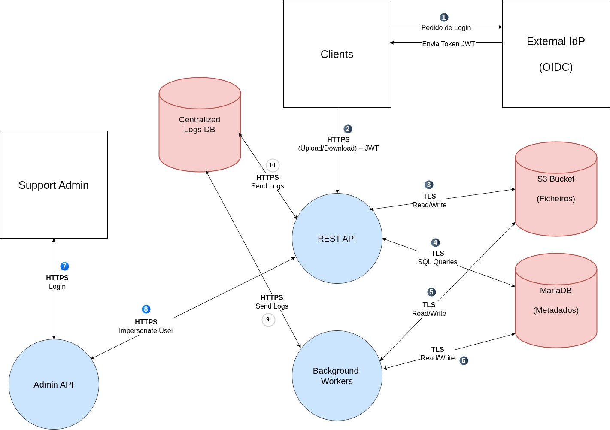

# Threat Modeling (STRIDE) — "Advanced File Storage API"

**Goal:** Build a threat model for a realistic File Storage API. Details next.

Consider the following link your starting point to get some information:
- [https://owasp.org/www-community/Threat_Modeling_Process](https://owasp.org/www-community/Threat_Modeling_Process)
- the source of the previous page (markdown) is [here](https://github.com/OWASP/www-community/blob/master/pages/Threat_Modeling_Process.md)

But I recommend that you investigate more as you go through the exercise:
- you can check [https://github.com/hysnsec/awesome-threat-modelling](https://github.com/hysnsec/awesome-threat-modelling) to get more information

Briefly, there are 4 essential steps described in the previously mentioned [web page](https://owasp.org/www-community/Threat_Modeling_Process):
1. [Scope your work](https://owasp.org/www-community/Threat_Modeling_Process#step-1-scope-your-work) - "What are we working on?";

2. [Determine Threats](https://owasp.org/www-community/Threat_Modeling_Process#step-2-determine-threats) - ([some STRIDE examples](https://threat-modeling.com/the-ultimate-list-of-stride-threat-examples/)) - "What can go wrong?" 

3. [Determine Countermeasures and Mitigation](https://owasp.org/www-community/Threat_Modeling_Process#step-3-determine-countermeasures-and-mitigation) - "What are we going to do about it?" 

4. [Assess your work](https://owasp.org/www-community/Threat_Modeling_Process#step-4-assess-your-work) - "Did we do a good enough job?"

## System's description:

- A REST API provides: upload, download, delete, list, file versioning, share links (with or without authentication --- the latter means anonymous sharing), read and set permissions.

- Clients: web app + mobile app.

- Auth: OIDC([link1 - microsoft](https://www.microsoft.com/en-us/security/business/security-101/what-is-openid-connect-oidc); [link2 - google](https://developers.google.com/identity/openid-connect/openid-connect) login via an external IdP ([suggested reading about IdP](https://developer.okta.com/docs/concepts/identity-providers/)); Also check [JWT](https://www.jwt.io/).

- Storage: objects in, for example, an [S3 bucket](https://aws.amazon.com/s3/) or similar; metadata is stored in a relational DB (for example, [MariaDB](https://mariadb.org/)).

- Background workers: file scanning + thumbnail generation --- but the user can also select "full privacy mode" and encrypts files before sending them via the API (server never sees "plaintext"); such feature disables the possibility of file scanning and thumbnail creation.

- Admin portal: user support people can login as ("impersonate") users (for example, to debug issues...).

- Observability: centralized logs and traces -- traces carry a request ID across services/components (API;DB;workers;etc.) so you the system can reconstruct end-to-end request paths, pinpoint latency/failure hotspots, and investigate incidents. You should enforce access control and carefull redaction of logs to avoid leaking secrets/PII (personally identifiable information) -- for example, logs should not show a person's name or anything sensitive.

- Tenancy: multi-tenant -- a single deployed service serves many customers, and each customer is a separate tenant with logically isolated users, data, and permissions (no cross-tenant access --- which means if I'm Bob I cannot access Alice's files).

## Tasks

The following tasks may be done collaboratively by 1, 2 or 3 students. The goal is to discuss and learn together. All students should write and push their answers. They should peer-review their collegues answers. All students should declare their collegues. Replace the XXXXX only if applicable. Feel free to use tools (check the [link](https://github.com/hysnsec/awesome-threat-modelling)) to draw a data flow diagram for instance. 

**Student number 1** pg57900

### Threat modelling summary

Write a summary of what is threat modelling and how it helps in securing software.

O Threat Modeling é uma abordagem estruturada para identificar, quantificar e mitigar riscos de segurança de software, idealmente durante a fase de design.
Permite à equipa de desenvolvimento antecipar "o que pode correr mal", descobrir vulnerabilidades de arquitetura, priorizar esforços de segurança e desenhar defesas adequadas desde o início (Security by Design), poupando tempo e dinheiro que seriam gastos a corrigir falhas em produção.

---

### What is STRIDE?

Write a summary about STRIDE.

STRIDE é um modelo criado pela Microsoft para ajudar a identificar e categorizar ameaças de segurança:

[S]poofing: Fazer-se passar por outra pessoa ou sistema.
[T]ampering: Modificar dados de forma não autorizada.
[R]epudiation: Realizar uma ação sem que o sistema consiga provar quem a fez.
[I]nformation Disclosure: Aceder a dados sem permissão para tal.
[D]enial of Service: Tornar um serviço indesponível com o "overload" do mesmo.
[E]levation of Privilege: Um utilizador estar com privélégios que não era suposto, um guest user com privilégios de admin.

---

### "What are we working on?" 

Check the link and fill in the information.
Don't forget to put a DFD (data flow diagram) here (push the image into an `images/` directory and insert a link; check that it render properly on github). Use any tool of your choice.

O sistema é uma Advanced File Storage API, uma arquitetura REST multi-tenant desenhada para clients Web e Mobile. O sistema permite (upload, download, delete, list, versioning) e partilha.

Os principais componentes e fronteiras de confiança (Trust Boundaries) incluem:

Autenticação: Delegada num Identity Provider externo via OIDC, com a API a consumir tokens JWT.

Armazenamento: Os ficheiros são guardados num bucket S3, enquanto os metadados ficam numa BD relacional (MariaDB).

Processamento em Background: Workers assíncronos que fazem o scan de ficheiros e geram thumbnails (desativados quando os ficheiros são encriptados no cliente em "full privacy mode").

Administração: Um portal de suporte que permite aos Admins fazer impersonate (agir em nome de) dos utilizadores para efeitos de debugging.

Observabilidade: Um sistema de logs e traces centralizado que recolhe dados da API, DB e workers.

---

### "What can go wrong?"

Write some list here.

[S]poofing: Um atacante interceta um token JWT (por falha na configuração do OIDC)... conseguindo assim Authenticar na API.

[T]ampering: Alteração de ficheiros dos metadados na MariaDB através de SQL Injection.

[R]epudiation: Um elemento da equipa de suporte usa a funcionalidade de impersonate no Portal de Admin para apagar ficheiros, mas os logs apenas registam a ação em nome do utilizador, impossibilitando provar que foi o Admin a executá-la.

[I]nformation Disclosure:O utilizador Bob altera o ID do pedido na API e consegue descarregar os ficheiros da utilizadora Alice.

[D]enial of Service: Um client mal intencionado faz upload de ficheiros gigantescos repetidamente para bloquear o scan, esgotando os recursos dos Background Workers e bloqueando o serviço para outros tenants.

[E]levation of Privilege: Um guest manipula os endpoints da API para aceder às rotas exclusivas do Portal de Admin, ganhando acesso admin.

---

### "What are we going to do about it?"

Write some list here.

[S]poofing: Validar o JWT na API verificando todos os parametros necessários (a assinatura, o emissor, a data de expiração...)! Garantir que a comunicação é feita por HTTPS/TLS para impedir a interseção do mesmo.

[T]ampering: Utilizar Queries já criadas para eliminar a possibilidade de ataques de SQL Injection.

[R]epudiation: Implementar logs de auditoria detalhados e imutáveis. Sempre que a função de impersonate for utilizada, o sistema tem de registar o contexto real no log (exemplo: Admin [ID] apagou o ficheiro [X] a fazer-se passar pelo Utilizador [ID]).

[I]nformation Disclosure: Aplicar validação rigorosa de autorização baseada no Tenant ID. A API deve sempre validar no servidor se o utilizador autenticado pertence ao mesmo tenant do ficheiro solicitado, rejeitando o pedido mesmo que o ID no URL seja alterado.

[D]enial of Service: Implementar Rate Limiting por utilizador. Definir limites máximos rígidos para o tamanho dos ficheiros e configurar quotas na fila de processamento dos Background Workers.

[E]levation of Privilege: Implementar Acess Control (i.e RBAC). Garantir o principio de Least Privilege

---

