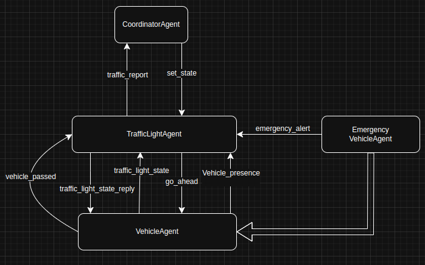
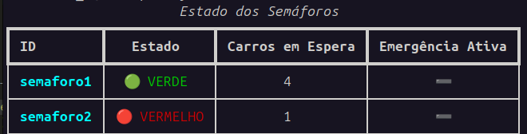

# ASM - Sistema de Gestão de Semáforos Inteligentes

Este projeto implementa um sistema de gestão de semáforos inteligentes utilizando agentes baseados no framework **SPADE**. O objetivo é simular um ambiente onde semáforos, veículos e veículos de emergência interagem de forma coordenada para otimizar o fluxo de tráfego e priorizar situações de emergência.

## Estrutura do Projeto

O projeto está organizado da seguinte forma:

- **`main.py`**: Arquivo principal que inicializa os agentes e configura o cenário com base no arquivo `cenario_1.json`.
- **`cenario_1.json`**: Arquivo de configuração que define os semáforos e suas relações (ex.: semáforos opostos).
- **`dashboard.py`**: Interface de terminal que exibe o estado dos semáforos em tempo real.
- **`Agents/`**: Contém as definições dos agentes:
  - **`coordinatorAgent.py`**: Agente coordenador responsável por gerenciar os semáforos com base no tráfego e emergências.
  - **`trafficLightAgent.py`**: Agente que representa um semáforo, gerencia veículos e responde a comandos do coordenador.
  - **`vehicleAgent.py`**: Agente que representa um veículo normal.
  - **`emergencyVehicleAgent.py`**: Agente que representa um veículo de emergência.
- **`Behaviours/`**: Contém os comportamentos dos agentes, como:
  - Comunicação entre veículos e semáforos.
  - Lógica de controle dos semáforos.
  - Relatórios de tráfego e alertas de emergência.

<p align="center">
  
</p> 

## Funcionalidades

1. **Gerenciamento de Semáforos**:
   - Os semáforos alternam entre os estados `VERMELHO`, `AMARELO` e `VERDE` com base na lógica do coordenador.
   - Priorização de veículos de emergência, alterando o estado dos semáforos para facilitar sua passagem.

2. **Simulação de Tráfego**:
   - Veículos normais são gerados aleatoriamente e enviam mensagens para os semáforos solicitando permissão para atravessar.
   - Veículos de emergência são gerados periodicamente e enviam alertas para os semáforos e o coordenador.

3. **Dashboard em Tempo Real**:
   - Exibe o estado atual dos semáforos, o número de veículos em espera e se há uma emergência ativa.

4. **Coordenação Centralizada**:
   - O agente coordenador toma decisões com base nos relatórios de tráfego e emergências recebidos dos semáforos.

<p align="center">
  
</p> 

## Como Executar

1. Certifique-se de ter o framework **SPADE** instalado:
   ```bash
   pip install spade
   ```
2. Correr 

    ```py
    python3 main.py
    ```